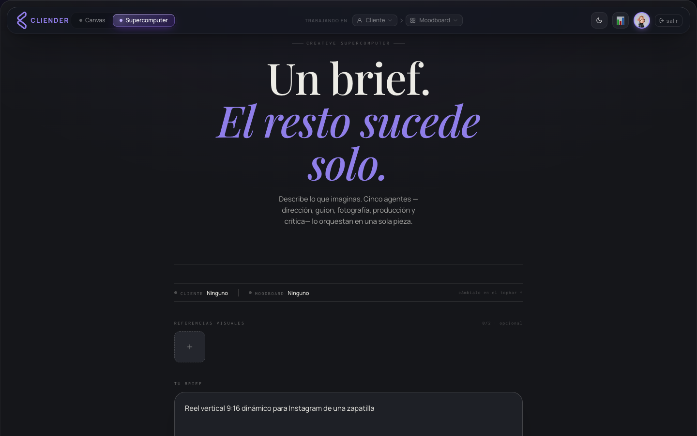

<div align="center">

# 🎨 Cliender Design Pro

### A node-based creative studio for AI-assisted brand content

Compose a visual pipeline on an infinite canvas, let a multi-agent director swarm
turn a prompt into on-brand images and video, and keep every brand's style consistent
with reusable moodboards.


</div>

---

## 📸 Screenshot



> The dark "quiet luxury" canvas: drag nodes, wire them up, and watch a prompt flow
> from concept to rendered media.

---

## Overview

**Cliender Design Pro** is a creative production tool built around a node graph. Instead
of a single chat box, you build a small pipeline — *brand → prompt → director → image →
video* — and run it. A swarm of Claude-powered agents plans the shot, writes the prompt,
chooses the camera language, generates the media through KIE.ai, and critiques the result
before it lands in your gallery.

It ships in three pieces that run together with one `docker compose up`:

- a **React canvas** (served as a zero-build prototype),
- a **FastAPI + LangGraph backend** that orchestrates the agents, and
- a **Remotion render service** that stitches scenes into final video.

---

## ✨ Features

| | Feature | What it does |
|---|---|---|
| 🧩 | **Node canvas** | Infinite, pannable canvas. Wire prompt, brand, image and video nodes into a runnable creative pipeline. |
| 🤖 | **Multi-agent director swarm** | A LangGraph cycle — *Master Director → Scriptwriter → Cinematographer → Production → Critic* — plans, generates and self-reviews each shot, with a Vision Auditor checking the output. |
| 🖼️ | **Image & video generation** | Generates stills and short clips via KIE.ai models (e.g. `gpt-imagenes-2`, `nano-banana-*`, `seedance-2.0`). |
| 🎨 | **Moodboards & Style Vault** | Build moodboards that distill a brand into a reusable master style prompt, palette, lighting and composition rules — so every generation stays on-brand. |
| 🗂️ | **Gallery** | Every generation is collected, previewable and downloadable; scenes can be assembled into a single video. |
| 🎬 | **Remotion assembly** | Renders multi-scene storyboards into final MP4s with captions and a logo overlay. |
| 📊 | **Cost analytics** | Tracks API spend with a configurable daily limit. |

---

## 🛠️ Tech Stack

| Layer | Technology |
|---|---|
| Frontend | React 18 (CDN + Babel), Three.js, GSAP, custom CSS design tokens |
| Backend | FastAPI, LangGraph, Pydantic v2, httpx, SSE streaming |
| Cognition | Anthropic Claude |
| Visual generation | KIE.ai (image + video models) |
| Video render | Remotion (Node + headless Chromium) |
| Storage / auth | Supabase (optional) |
| Packaging | Docker + Docker Compose, nginx |

---

## 🏗️ Architecture

```
                       ┌───────────────────────────────┐
        browser  ◀────▶│  frontend  (nginx :2002)       │
                       │  React node canvas + Login     │
                       └───────────────┬───────────────┘
                                       │  /api  (REST + SSE)
                       ┌───────────────▼───────────────┐
                       │  backend  (FastAPI :3003)       │
                       │  LangGraph director swarm:      │
                       │   Master Director → Scriptwriter│
                       │   → Cinematographer → Production│
                       │   → Critic (+ Vision Auditor)   │
                       └───────┬───────────────┬────────┘
                               │               │
                  Claude (brain)        KIE.ai (image/video)
                               │
                       ┌───────▼───────────────┐
                       │  remotion (:4010)       │
                       │  scene → MP4 assembly   │
                       └─────────────────────────┘
```

Repository layout:

```
.
├── frontend/   # React node-canvas prototype (nginx static)
├── backend/    # FastAPI + LangGraph multi-agent backend
├── remotion/   # Remotion video render service
├── deploy/     # docker-compose stack + start scripts
└── docs/       # screenshots and docs
```

---

## 🚀 Getting Started

### Prerequisites

- [Docker](https://www.docker.com/products/docker-desktop) + Docker Compose
- An [Anthropic API key](https://console.anthropic.com/)
- A [KIE.ai](https://kie.ai/) API key
- *(optional)* a Supabase project for auth, shared store and cost analytics

### Run it

```bash
git clone https://github.com/<your-org>/cliender-design-pro.git
cd cliender-design-pro

# 1. Configure secrets
cp .env.example deploy/.env
#    edit deploy/.env and fill in ANTHROPIC_API_KEY and KID_AI_API_KEY

# 2. Start the stack
cd deploy
docker compose up -d --build

# 3. Open the app
open http://localhost:2002
```

| Service | URL |
|---|---|
| Canvas / UI | <http://localhost:2002> |
| Backend API + docs | <http://localhost:3003/docs> |
| Remotion render | <http://localhost:4010/health> |

> **Supabase (optional):** the browser reads `window.__CDPRO_SUPABASE_URL` and
> `window.__CDPRO_SUPABASE_ANON_KEY` at runtime. Inject them at deploy time (or leave
> the `YOUR_SUPABASE_*` placeholders to run the canvas without auth/storage).

---

## 🗂️ Project Structure

```
frontend/
├── Login.html              # auth + animated card carousel
├── Canvas Prototype.html   # app shell (loads the React prototype)
├── nginx.conf
├── Dockerfile
└── prototype/
    ├── app.jsx             # canvas app root
    ├── nodes.jsx           # node graph
    ├── leftmenu.jsx        # clients, agents, settings (demo data)
    ├── vault.jsx           # moodboards / Style Vault
    ├── analytics.jsx       # cost analytics view
    ├── astronaut.jsx       # Three.js mascot
    ├── *.css               # design tokens + component styles
    └── assets/             # logos + avatars

backend/
└── app/
    ├── main.py             # FastAPI app, rate limiting, API-key gate
    ├── core/config.py      # settings + KIE.ai model allow-list
    ├── api/routes/         # generate, agent, moodboard, gallery, analytics, store...
    ├── graph/              # LangGraph swarm (builder, state, nodes/)
    ├── services/           # claude_client, kid_ai_client, prompt brain, sanitizers
    └── tools/              # KIE.ai tool wrapper

remotion/
├── server.js               # /render + /health
└── src/                    # Remotion compositions (Stitch)

deploy/
├── docker-compose.yml
├── arrancar.sh / arrancar.bat
└── .env.example
```

---

## 🔒 Security Notes

- **No secrets in the repo.** All keys (Anthropic, KIE.ai, Supabase service key) are read
  from environment variables. Copy `.env.example` → `.env` and keep it out of git.
- The backend supports an optional **shared API-key gate** (`CDPRO_API_KEY`) plus
  per-IP **rate limiting** on resource-heavy endpoints.
- Outbound media fetching is guarded against SSRF, and prompts are sanitized before
  reaching generation models.
- The browser admin gate in the demo uses placeholder credentials — replace it with
  real backend-driven auth before any production use.

---

## 📄 License

[MIT](LICENSE) © HBD Revolution SL
